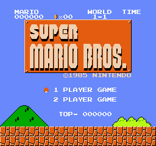

# NesUnity - In Progress

An NES emulator based on Unity3D for personally study，uncompleted。

## Current Status:

Unscrollable background only:

## Progress & planning:

1. Rom file: 
  * iNes (.nes file)  ✅  
2. CPU
  * Addressing modes ✅
  * Memory mapping ✅
  * Mappers 🔲
    * NROM ✅
    * Other
  * 6502 instructions ✅
    * official ✅
    * unofficial ✅  [Ref](http://www.oxyron.de/html/opcodes02.html)
    * Tested with nestest.nes log ✅
    * Disassmebly 🔲
3. PPU
  * Memeory mappings
    * Register ✅
    * IO ✅
    * Palette ✅ 
  * Backgrounds 🔲
    * NMI interruption ✅
    * PatternTable 🔲 
    * NameTable + AttributeTable 🔲
    * Scrolling
  * Sprites 
    * OAM
    * DMA
    * Priority
    * Sprite0 hit
    * Overscan  
 4. Input
 5. APU
  * Pulse
  * Triangle
  * Noise
  * DMC

